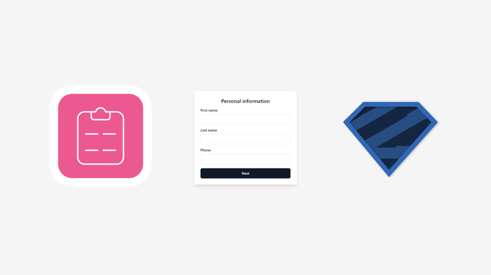

<div align="center">
  
</div>

# Description

This project is an example of how to use React Hook Form and Zod to create a multi-step form.

# Technologies used

- React  
- Vite  
- TypeScript  
- Tailwind  
- Shadcn/ui  
- Vitest  
- Testing Library  
- React Hook Form  
- Zod  

# To use this project, follow these steps:

Clone the project:

```bash
git clone https://github.com/[your-name]/[project-name]
```
Install the dependencies:
```bash
npm install
```

Start the project:
```bash
npm run dev
```
#### The project will start at the address http://localhost:5173.

# To test this project, follow these steps:

Run the tests:
```bash
npm run test
```

# Project structure

The project is structured as follows:

- .github
  - workflows
    - run-unit-tests.yml
- public
  - og.png
  - vite.svg
- src
  - __ tests __
    - Forms
      - Button.spec.tsx
      - PaymentInformation.spec.tsx
      - PersonalInformation.spec.tsx
      - RegistrationForm.spec.tsx
      - ShippingAddress.spec.tsx
    - setupTests.ts
  - @types
    - vite-env.d.ts
    - vitest.d.ts
  - assets
    - react.svg
  - components
    - Forms
      - Button
        - Button.tsx
        - index.ts
      - PaymentInformation
        - PaymentInformation.tsx
        - index.ts
      - PersonalInformation
        - PersonalInformation.tsx
        - index.ts
      - RegistrationForm
        - RegistrationForm.tsx
        - index.ts
      - ShippingAddress
        - ShippingAddress.tsx
        - index.ts
    - ui
      - button.tsx
      - input.tsx
      - label.tsx
      - toast.tsx
      - toaster.tsx
      - use-toast.ts
  - lib
    - utils.ts
  - validations
    - paymentInformation.ts
    - personalInformation.ts
    - registrationForm.ts
    - shippingAddress.ts
  - App.tsx
  - App.css
  - index.css
  - main.tsx
  - .eslintrc.cjs
  - .gitignore
  - index.html
  - LICENSE
  - package-lock.json
  - package.json
  - postcss.config.js
  - README.md
  - tailwind.config.js
  - tsconfig.json
  - tsconfig.node.json
  - vite.config.ts
  - vitest.config.ts

# Form

The project's form is composed of three steps:

- Step 1: Personal information  
- Step 2: Shipping address  
- Step 3: Payment information  

#### Each step of the form is validated using Zod.  

## Example of use

#### To fill out the form, follow these steps:

- In step 1, enter your personal information.  
- In step 2, enter your shipping address.  
- In step 3, enter your payment information.  

#### When you click the "Submit" button, the form will be submitted.

# Acknowledgements

React, Vite, TypeScript, Tailwind, Shadcn/ui, Vitest, Testing Library, React Hook Form, and Zod are thanked for providing the tools necessary to create this project.

# Contributions

Contributions are welcome. To contribute, follow these steps:

- Fork the project.  
- Create a branch with your changes.  
- Commit your changes.  
- Make a pull request to the main branch.  

### Thank you for using this project!